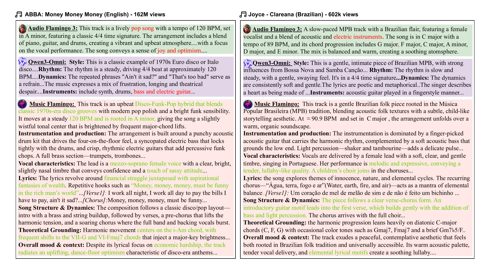
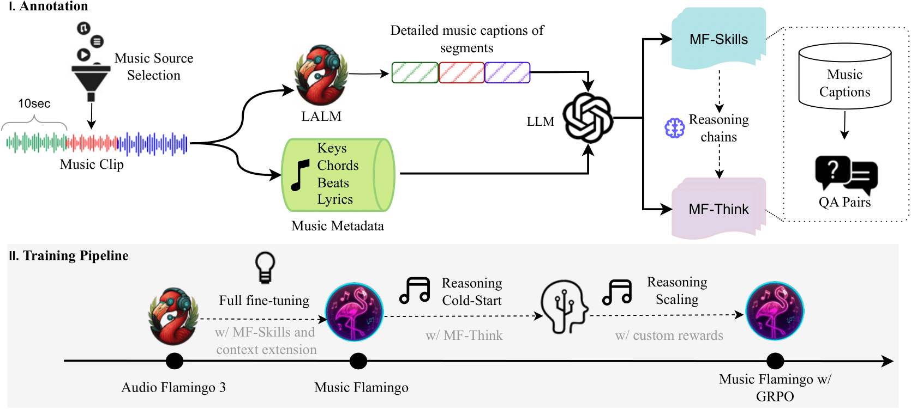
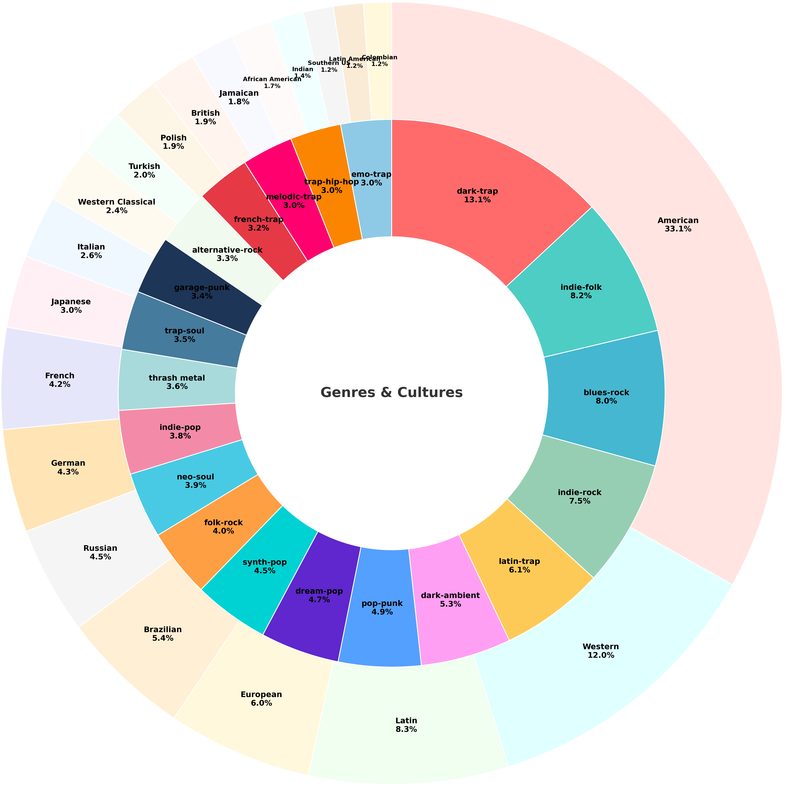
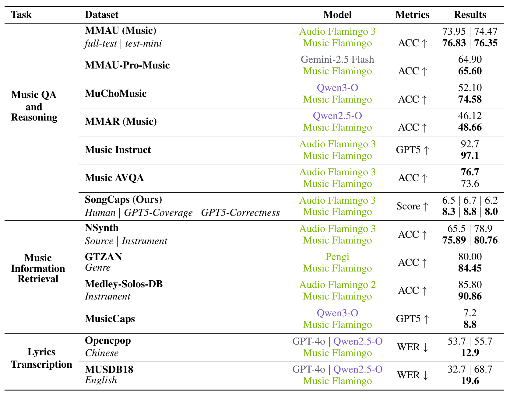
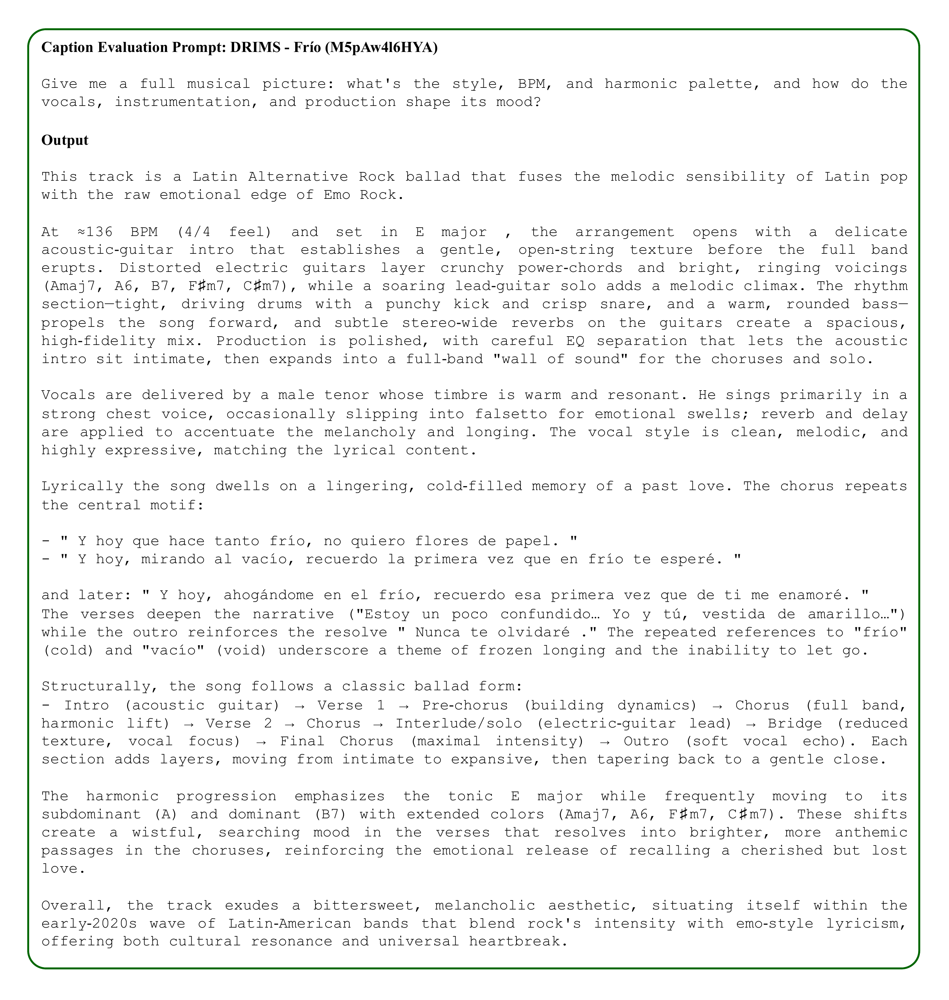
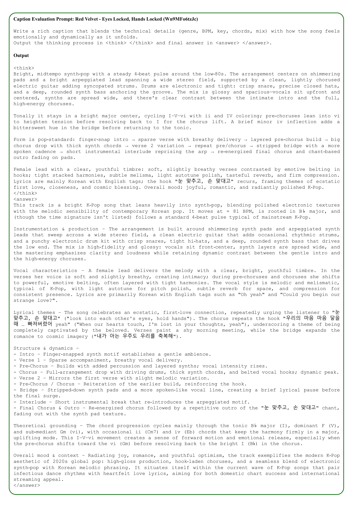
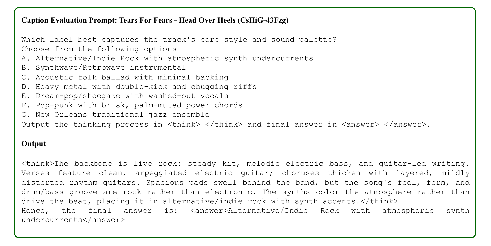

  
  <h1>Music Flamingo 
    
      Scaling Music Understanding in Audio Language Models
    
  </h1>

#### [[Paper]](https://musicflamingo-nv-umd.github.io/figures/Music_Flamingo_Preprint.pdf) &nbsp;&nbsp; [[Gradio Demo (7B)]](https://be932afcd9dff566fd.gradio.live) &nbsp;&nbsp; Code & Checkpoints (coming soon)

#### Authors: Sreyan Ghosh1,2*, Arushi Goel1*, Lasha Koroshinadze2**, Sang-gil Lee1, Zhifeng Kong1, Joao Felipe Santos1*, Ramani Duraiswami2*, Dinesh Manocha2, Wei Ping1, Mohammad Shoeybi1, Bryan Catanzaro1

#### Affiliations: 1NVIDIA, CA, USA &nbsp;|&nbsp; 2University of Maryland, College Park, USA

*Equally contributed and led the project. Names randomly ordered. **Significant technical contribution.

**Correspondence:** sreyang@umd.edu, arushig@nvidia.com

### Overview

We introduce **Music Flamingo**, a novel large audio–language model, designed to advance music (including song) understanding in foundational audio models. While audio–language research has progressed rapidly, music remains challenging due to its dynamic, layered, and information-dense nature. Progress has been further limited by the difficulty of scaling *open* audio understanding models, primarily because of the scarcity of high-quality music data and annotations. As a result, prior models are restricted to producing short, high-level captions, answering only surface-level questions, and showing limited generalization across diverse musical cultures. To address these challenges, we curate MF-Skills, a large-scale dataset labeled through a multi-stage pipeline that yields rich captions and question–answer pairs covering harmony, structure, timbre, lyrics, and cultural context. We fine-tune an enhanced Audio Flamingo 3 backbone on MF-Skills and further strengthen multiple skills relevant to music understanding. To improve the model's reasoning abilities, we introduce a post-training recipe: we first cold-start with MF-Think, a novel chain-of-thought dataset grounded in music theory, followed by GRPO-based reinforcement learning with custom rewards. Music Flamingo achieves state-of-the-art results across 10+ benchmarks for music understanding and reasoning, establishing itself as a generalist and musically intelligent audio–language model. Beyond strong empirical results, Music Flamingo sets a new standard for advanced music understanding by demonstrating how models can move from surface-level recognition toward layered, human-like perception of songs. We believe this work provides both a benchmark and a foundation for the community to build the next generation of models that engage with music as meaningfully as humans do.

  

### Music Flamingo at a Glance
- Trains on MF-Skills (~2M full songs, 2.1M captions averaging ~452 words, and ~0.9M Q&A pairs) spanning 100+ genres and cultural contexts.
- Processes ~15-minute audio inputs with a 24k-token context window for full-track reasoning.
- Uses Rotary Time Embeddings (RoTE) to align events to absolute timestamps and track tempo, key, and structural shifts.
- Supports on-demand chain-of-thought generation via MF-Think traces and GRPO-based post-training.
- Delivers state-of-the-art results on music QA, captioning, instrument/genre identification, and multilingual lyric transcription tasks.

### Model Innovations

#### Enhanced Flamingo Backbone
We start from the 7B Audio Flamingo 3 base and extend its audio front-end for music: larger memory budgets enable a 24k-token context and ~15-minute receptive field, while improved adapter layering keeps latency low for interactive demos. The model listens holistically to stems, vocals, and production cues, then grounds responses in both low-level descriptors and high-level narratives.

#### Time-Aware Listening
Temporal precision is vital for music. Music Flamingo adds Rotary Time Embeddings (RoTE) so that each audio token carries an absolute timestamp. This makes it easier to localize chord changes, tempo ramps, solos, and lyric entrances, and improves temporal alignment during both captioning and question answering.

#### Chain-of-Thought and Reinforcement Learning
To reason like a musician, we supervise intermediate thinking steps with MF-Think. Each prompt includes `<think>`...`</think>` traces that break down harmony, rhythm, timbre, and intent before producing the final answer. We then apply GRPO-based reinforcement learning with rewards that favor theory-correct explanations, accurate metadata (tempo/key/chords), and faithful lyric references.

  

### MF-Skills and MF-Think Datasets

MF-Skills is a large-scale dataset purpose-built for music understanding. Automated metadata extraction supplies tempo, key, chord, and lyric tags, while expert annotators author multi-paragraph captions and QA pairs that cover harmony, structure, timbre, vocal delivery, production techniques, and cultural context. The corpus intentionally balances global genres, from MPB and K-pop to Soviet-era rock and European classical, to promote cross-cultural generalization.

Key ingredients:
- **Song-level annotations:** Long-form captions that emulate liner notes, including chord progressions, instrumentation, mixing notes, and emotional arcs.
- **Music-first QA:** Multi-choice and open-form questions about form, vocal placement, lyrical themes, and mix decisions, rewritten to minimize language priors.
- **Metadata grounding:** Tempo, key, chord, and lyric tags integrated into training to stabilize theory-aware predictions.
- **Quality filters:** Multi-stage validation steps (automatic heuristics plus expert spot checks) to remove mislabels and stylistic bias.

MF-Think extends MF-Skills with structured reasoning demonstrations. Prompts include voice-leading breakdowns, rhythmic counting, and narrative interpretations, all expressed inside `<think>` tags before emitting concise answers. These traces prime Music Flamingo to provide transparent rationales during evaluation and deployment.

  
  
Distribution of genres (inner ring) and cultures (outer ring) across MF-Skills.

### Evaluation Highlights

Music Flamingo establishes new state-of-the-art results across music understanding, captioning, and retrieval benchmarks, outperforming both open and closed frontier models.

| Benchmark | Metric (up/down) | Prior Best | Music Flamingo |
| --- | --- | --- | --- |
| SongCaps (ours) | GPT5 coverage / correctness | 6.5 / 6.7 / 6.2 (Audio Flamingo 3) | **8.3 / 8.8 / 8.0** |
| MusicCaps | GPT5 (up) | 7.2 (Qwen3-O) | **8.8** |
| MuChoMusic | ACC (up) | 52.10 (Qwen3-O) | **74.58** |
| MMAU-Pro-Music | ACC (up) | 64.90 (Gemini-2.5 Flash) | **65.60** |
| NSynth | ACC (up) | 65.5 / 78.9 (Audio Flamingo 3) | **75.89 / 80.76** |
| Opencpop (zh lyrics) | WER (down) | 53.7 / 55.7 (GPT-4o / Qwen2.5-O) | **12.9** |
| MUSDB18 (en lyrics) | WER (down) | 32.7 / 68.7 (GPT-4o / Qwen2.5-O) | **19.6** |

Additional takeaways:
- Beats Audio Flamingo 3 on Music Instruct (97.1 vs. 92.7 GPT5) and Medley-Solos-DB instrument recognition (90.86 vs. 85.80 ACC).
- Maintains strong performance on legacy evaluations such as GTZAN (84.45 ACC) while improving descriptive richness preferred by professional musicians.
- Qualitative reviews note more faithful chord tracking, better localization of structural events, and balanced treatment of vocals, instrumentation, and production.

  

### Qualitative Analyses

Music Flamingo produces long-form narratives that connect technical attributes with emotional storytelling:
- **Synth-pop narrative (Taylor Swift - "The Fate of Ophelia"):** Identifies ~125 BPM tempo, F major key, evolving synth textures, and lyric themes of rescue and transformation.
- **Duet ballad (Lady Gaga & Bruno Mars - "Die With A Smile"):** Tracks call-and-response phrasing, layered vocal harmonies, and dynamic swells tied to the romantic storyline.
- **Global catalog coverage:** Analyzes Latin folk (Niuver - "Enamorados"), indie pop (Annika Wells - "Jim & Pam"), French pop ballads (Louane - "La fille"), Brazilian forro (Michel Telo - "Ai Se Eu Te Pego"), and Soviet rock classics ("Trava u doma") with culturally grounded vocabulary.
- **Dataset previews:** PDF snippets linked from the demo surface MF-Skills captions, MF-Think traces, and Q&A pairs for multiple languages and styles.

#### Example: Taylor Swift - "The Fate of Ophelia"

**Prompt:**  
Describe this track in full detail - tell me the genre, tempo, and key, then dive into the instruments, production style, and overall mood it creates.

**Music Flamingo response:**

This track is an energetic Synth-Pop / Electropop piece that blends bright, melodic synth-pop sensibilities with a polished, modern electronic production aesthetic.

Tempo & Key - The song moves at ≈125 BPM and is rooted in F major.

Instrumentation & Production - The arrangement is built around a palette of layered synthesizers: arpeggiated synth lines, lush pads, and a driving synth-bass that anchors the groove. Electronic drums provide a tight, punchy backbeat with crisp hi-hats and a solid kick that keeps the rhythm propulsive. The mix is clean and wide, with stereo-spread synth textures and a polished mastering chain that emphasizes clarity and punch, giving the track a contemporary pop sheen.

Vocal Characteristics - A female lead delivers the verses and choruses with a clear, slightly breathy timbre. Her performance is melodic and expressive, conveying vulnerability and determination. The vocals are processed with tasteful reverb and delay, creating a spacious, ethereal ambience that sits atop the synth-driven backdrop.

Lyrical Themes - The lyrics explore a narrative of rescue and transformation, using the metaphor of "Ophelia" to depict a past of isolation and a newfound sense of purpose. Repetitive chorus lines such as:

- "All that time I sat alone in my tower…
- "You dug me out of my grave and saved my heart from the fate of Ophelia"

underscore the themes of being rescued, gaining clarity, and moving forward with confidence.

Song Structure & Dynamics - The composition follows a classic pop layout: an instrumental intro that establishes the synth motif, followed by verses that introduce the storytelling, a pre-chorus that builds tension, and a soaring chorus where the vocal hook and full synth arrangement lock in. A bridge provides a brief harmonic shift before returning to the final chorus, which is layered with additional vocal harmonies and a subtle lift in the synth arrangement, culminating in an uplifting outro.

Theoretical Insight - Harmonic movement largely orbits the tonic F major, with frequent use of the subdominant Bb and dominant C chords (e.g., F - Bb - C) that reinforce the bright, hopeful mood. Occasional minor-toned chords such as Gm and Dm7 introduce brief moments of introspection, especially in the verses, before resolving back to the major-key choruses for emotional release.

Overall Mood & Context - The track radiates an uplifting, determined atmosphere, marrying the glossy production of 2020s electropop with lyrical storytelling that feels both personal and anthemic. Its sound situates it firmly within contemporary synth-pop trends, appealing to listeners who enjoy bright, dance-able melodies paired with emotionally resonant vocals.

## Dataset Examples

### MF-Skills: Ground-truth captions

  
  
MF-Skills caption example: Latin song

### MF-Think: Ground-truth captions with thinking traces

  
  
MF-Think caption example with thinking traces: Korean song

### MF-Think: Q&A pairs with thinking traces

  
  
MF-Think Q&A example with thinking traces

### Availability and Responsible Use

- **Paper & Demo:** The preprint and interactive Gradio demo are live today. Demo runs the 7B checkpoint with streaming audio playback and captioning.
- **Code & Weights:** Training recipes, checkpoints, and detailed data release notes are in progress and will be posted soon on this page.
- **Datasets:** MF-Skills and MF-Think samples are viewable via linked PDFs; full releases will follow with research-only licensing and cultural sensitivity guidelines.
- **Responsible deployment:** Music Flamingo is designed for research and educational use. We encourage human-in-the-loop review when using outputs for creative, editorial, or rights-sensitive workflows.

## Citation

Citation details will be posted once the preprint receives its permanent identifier.
